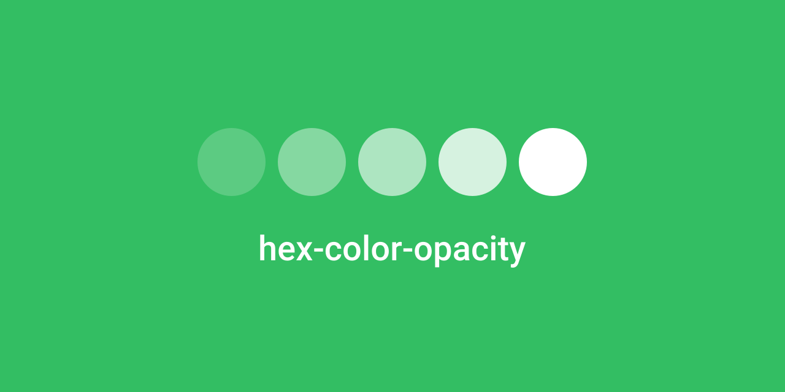

## Install

``` shell
npm i hex-color-opacity
```

## Usage

``` js
const opacity = require('hex-color-opacity')

opacity('#FFFFFF', 0.5)
```


## Documentation

### Adding opacity to hexadecimal color values

To add opacity to a hex color simply pass the color value (this includes the **#** character) and the desired opacity as a number value between 0 and 1 to the opacity function. The resulting hex value is returned. Support for 3 value hex colors is provided out of the box. All hex values are returned in upper case.

For example: 

``` js
opacity('#FFF', 0.5) // #FFFFFF80
```

## Contributing

Contributors are welcome, feel free to submit a new [pull request](https://github.com/dominicegginton/hex-color-opacity/pulls)  to help improve **hex-color-opacity**.
